# Architecture Document

# AI-Powered Developer Copilot Platform

---

| Field              | Detail                                   |
|--------------------|------------------------------------------|
| Document Version   | 1.0                                      |
| Status             | Draft                                    |
| Product Name       | AI-Powered Developer Copilot Platform    |
| Document Type      | System Architecture                      |
| Last Updated       | June 2025                                |
| Classification     | Internal — Confidential                  |

---

## Table of Contents

1. System Overview
2. High-Level Architecture
3. Major Components
4. Clean Architecture Layers
5. Service Boundaries
6. Repository Processing Pipeline
7. RAG Architecture
8. LangGraph Agent Architecture
9. Repository-Aware Chat Architecture
10. Event Flow
11. Folder Structure
12. Deployment Overview

---

## 1. System Overview

The AI-Powered Developer Copilot Platform is a multi-tenant SaaS system designed to provide repository-aware AI intelligence to software engineering teams. It ingests source code repositories (via ZIP upload or GitHub integration), indexes them into a semantic knowledge base, and exposes a suite of AI-powered capabilities: multi-agent analysis, natural language chat, automated PR review, and engineering dashboards.

### Core Architectural Principles

The system is designed around the following non-negotiable architectural commitments:

**Clean Architecture** — All business logic is isolated from infrastructure. Dependency direction flows inward: outer layers (API, infrastructure) depend on inner layers (domain, application), never the reverse.

**Service Layer Pattern** — Every capability is encapsulated in a dedicated service class with a single responsibility. Services coordinate domain logic, delegate persistence to repositories, and delegate external calls to adapters.

**Repository Pattern** — All data access is abstracted behind repository interfaces. Services are never aware of the underlying database driver, ORM, or vector store client.

**Dependency Injection** — All service, repository, and adapter dependencies are injected at construction time via FastAPI's dependency injection system. No global state or singleton mutation.

**Async Processing** — Long-running operations (indexing, analysis, agent execution) are always decoupled from the request cycle using a task queue. The API returns job references immediately; clients poll or subscribe for completion.

**Modular Design** — Each major system (RAG, agents, GitHub integration, chat, auth) is a self-contained module with its own service layer, models, and interfaces. Modules communicate through well-defined service contracts, never via direct cross-module imports of internal logic.

**Strict OOP** — All business logic lives in classes. No procedural logic in route handlers, no logic in models. Handlers delegate to services; services orchestrate domain objects.

---

## 2. High-Level Architecture

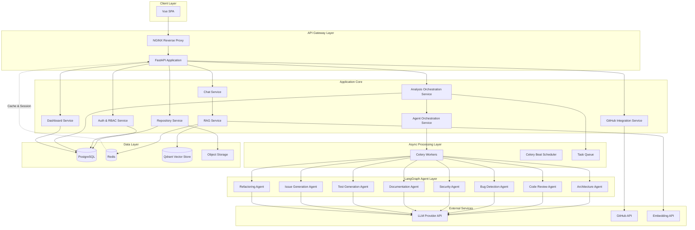

---

## 3. Major Components

### 3.1 Vue Frontend (SPA)

A single-page application built with Vue 3 and the Composition API. It communicates exclusively with the FastAPI backend via REST and Server-Sent Events (SSE) for streaming chat responses. The frontend enforces RBAC at the UI layer by interpreting permission scopes embedded in the JWT token.

Key UI modules: Repository Manager, Analysis Dashboard, Chat Interface, AI Analytics Dashboard, Repository Metrics Dashboard, GitHub Settings, User & Role Management.

### 3.2 FastAPI Backend

The central application server. It exposes the REST API, handles authentication middleware, enforces RBAC, validates all input, and delegates business logic entirely to the service layer. Route handlers are thin: they parse the request, call the appropriate service, and return the response. No business logic lives in route handlers.

FastAPI's dependency injection system wires all services, repositories, and adapters. All endpoints are async.

### 3.3 PostgreSQL

The primary relational store. It holds all structured data: tenants, users, roles, permissions, repositories (metadata), analysis jobs, agent findings, GitHub integration state, chat session metadata, and audit logs. All access is mediated by repository classes via SQLAlchemy async sessions.

### 3.4 Redis

Serves two roles: (1) a Celery message broker and result backend, and (2) a caching and session layer. Active chat session state, per-tenant rate limits, webhook deduplication keys, and frequently read configuration are cached in Redis. TTLs are set per data type.

### 3.5 Qdrant

The vector database. It stores chunked, embedded representations of all indexed repository content. Organized by tenant and repository, with metadata filters enabling RBAC-compliant retrieval. Supports both dense vector (semantic) and sparse vector (lexical/BM25) search. The RAG service is the exclusive interface to Qdrant.

### 3.6 Celery Workers

All async processing runs on Celery workers. Workers are stateless and horizontally scalable. Job types include: repository indexing, full and incremental analysis, individual agent execution, GitHub webhook processing, and scheduled re-indexing. Celery Beat handles time-based triggers (e.g., scheduled analysis runs, stale index checks).

### 3.7 LangGraph Agent Engine

Each of the eight AI agents is implemented as an autonomous LangGraph state machine. LangGraph manages the internal execution graph of each agent: RAG retrieval, LLM reasoning, tool invocation, self-reflection, and structured output generation. The Agent Orchestration Service launches and monitors agent graphs via Celery.

### 3.8 NGINX

The edge reverse proxy. Handles SSL termination, request routing to the FastAPI application, and static file serving for the Vue SPA. Upstream connection pooling and rate limiting at the edge layer.

---

## 4. Clean Architecture Layers

The backend is organized into four concentric layers. Inner layers define interfaces; outer layers implement them.

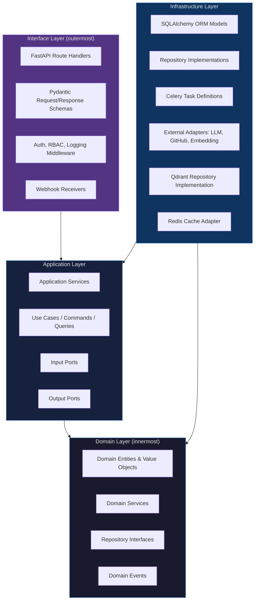

### Layer Responsibilities

**Domain Layer** — Pure Python classes representing business concepts: `Repository`, `AnalysisJob`, `AgentFinding`, `Tenant`, `User`, `ChatSession`, `RAGChunk`. No framework dependencies, no database imports. Repository interfaces (abstract base classes) are defined here. Domain events are raised here and consumed by the application layer.

**Application Layer** — Orchestrates use cases using domain objects and repository interfaces. Examples: `AnalysisOrchestrationService`, `RepositoryIngestionService`, `ChatService`, `RAGService`, `AuthService`. Services call repository interfaces for reads/writes. Services publish domain events. Services never import infrastructure classes directly.

**Infrastructure Layer** — Implements repository interfaces using SQLAlchemy, Qdrant client, and the Redis client. Provides Celery task wrappers. Contains all external adapters: LLM client wrapper, GitHub API client, embedding API client. This layer knows about the frameworks; the domain and application layers do not.

**Interface Layer** — FastAPI route handlers, Pydantic schemas, middleware (JWT validation, RBAC enforcement, request logging), and webhook receivers. Handlers call application services, never domain or infrastructure directly. Pydantic schemas are the contract boundary between API consumers and the application.

---

## 5. Service Boundaries

Each module is a self-contained vertical slice with its own services, domain entities, repository interfaces, and infrastructure implementations.

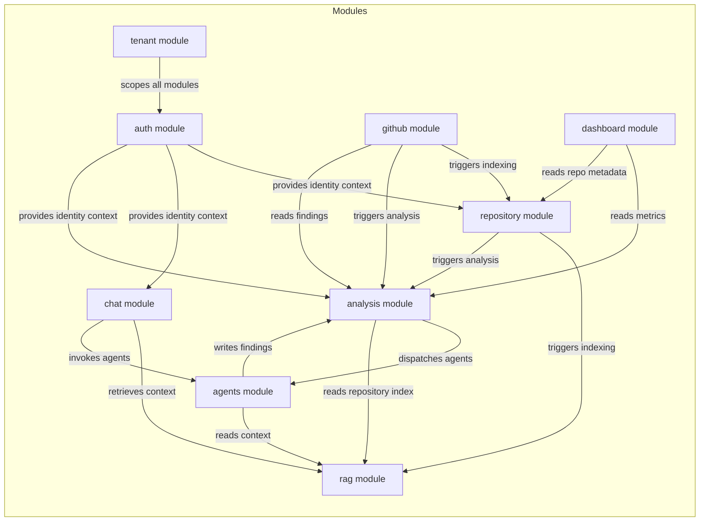

**Cross-cutting boundary rules:**
- Modules communicate only via their service interfaces. No direct repository cross-imports.
- Tenant ID is a required context parameter on every service method. Enforced at the application layer boundary.
- All inter-module calls that involve persistence or async operations go through the application service, not directly to infrastructure.

---

## 6. Repository Processing Pipeline

This pipeline executes whenever a repository is uploaded (ZIP) or connected/updated (GitHub). It runs entirely on Celery workers and is idempotent by design.

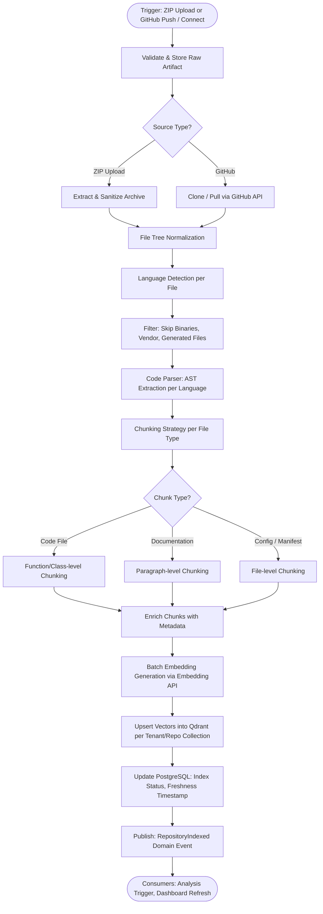

### Pipeline Stages

**Validation & Storage** — Input is validated for size, MIME type, and archive integrity. The raw artifact is stored in object storage. A repository record in PostgreSQL transitions to `indexing` state.

**Extraction / Clone** — ZIP archives are extracted in a sandboxed temporary directory. GitHub repositories are cloned or pulled into the worker's ephemeral workspace.

**Normalization** — File paths are normalized. Binary files, vendored dependencies (`node_modules`, `.git`, build artifacts), and auto-generated files are excluded via configurable filter rules.

**Parsing** — Language-aware parsers extract AST-level metadata: function names, class names, import statements, docstrings. This metadata is attached to chunks for filtering and citation.

**Chunking** — Code is chunked at function/method granularity to preserve semantic units. Documentation is chunked at paragraph level. Configuration files are kept as single chunks.

**Embedding** — Chunks are batched and sent to the embedding API. Both dense embeddings (for semantic search) and sparse representations (for BM25 lexical search) are generated.

**Vector Upsert** — Embeddings are upserted into the tenant-scoped Qdrant collection with full metadata payloads (file path, line range, language, chunk type, repository ID).

**Status Update** — PostgreSQL repository record transitions to `ready`. Index freshness timestamp is recorded. A domain event is published for downstream consumers.

---

## 7. RAG Architecture

The RAG system is the shared intelligence backbone consumed by all AI features: chat, agents, and analysis. It provides hybrid retrieval (semantic + lexical) with RBAC-enforced scoping.

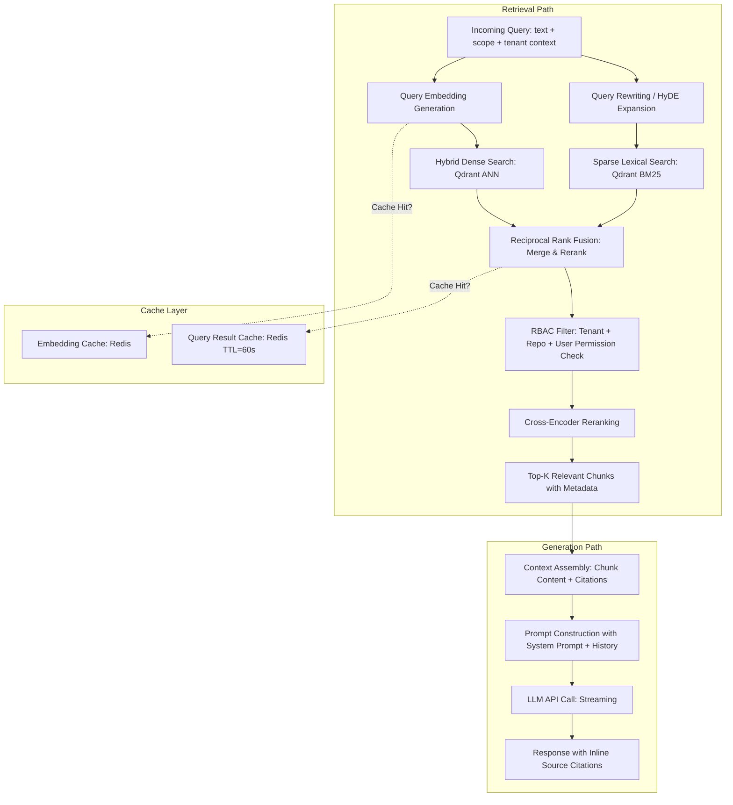

### RAG Design Decisions

**Hybrid Retrieval** — Dense vector search alone misses exact identifier matches (function names, error codes). BM25 lexical search alone misses semantic synonyms. Reciprocal Rank Fusion combines both ranked lists into a single merged ranking without requiring score normalization.

**RBAC Enforcement at Retrieval** — Tenant and repository scoping is applied as a Qdrant metadata filter on every query. Users can never retrieve chunks from repositories they do not have access to, regardless of semantic similarity.

**Cross-Encoder Reranking** — After the initial approximate retrieval, a lightweight cross-encoder model reranks the top-N chunks by relevance to the specific query. This improves precision without the latency of a full re-embedding.

**HyDE (Hypothetical Document Embeddings)** — For ambiguous or complex queries, the system generates a hypothetical ideal answer and embeds it. This produced embedding often retrieves more relevant chunks than the raw question embedding.

**Citation Attachment** — Every chunk passed to the LLM carries structured metadata (file path, start/end line, function name, repository). The LLM is instructed to cite these in its response. The application layer maps citation tokens back to actual file locations for the client.

---

## 8. LangGraph Agent Architecture

All eight AI agents are implemented as LangGraph state machines. Each agent follows the same structural pattern: Plan → Retrieve → Reason → Reflect → Output.

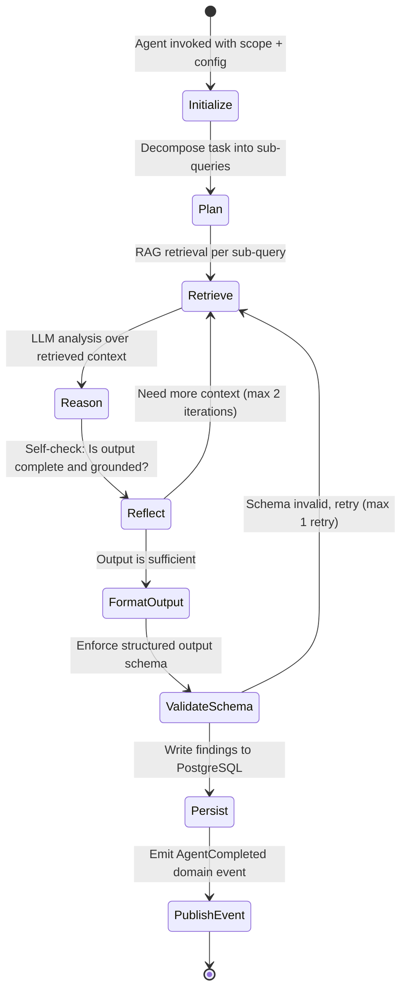

### Agent Orchestration

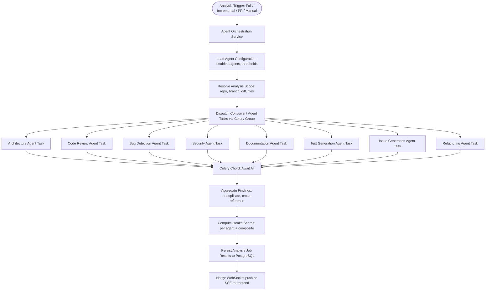

### Agent Isolation Guarantee

Each agent runs in an isolated Celery task. An exception in one agent task does not propagate to sibling tasks. The orchestration layer captures the status of each agent independently. Partial results (successful agents) are surfaced in the UI with a clear `failed` status indicator on any agent that did not complete. The analysis job is never marked `failed` due to a single agent failure.

### Agent Internal Structure (Per Agent)

Each agent class contains:

- **Planner Node** — Decomposes the agent's task into a set of targeted retrieval queries based on its specialization.
- **Retriever Node** — Calls the RAG service with agent-specific retrieval parameters (e.g., Security Agent retrieves dependency manifests and authentication code; Architecture Agent retrieves module entry points and import graphs).
- **Reasoner Node** — Passes retrieved context to the LLM with an agent-specific system prompt and structured output schema.
- **Reflector Node** — Evaluates whether the output is sufficiently grounded and complete. Triggers a second retrieval pass if not.
- **Output Formatter Node** — Serializes findings into the standard `AgentFinding` schema: title, description, file paths, line ranges, severity, confidence, category, remediation.
- **Schema Validator** — Validates the structured output against the Pydantic schema before persistence. Retries if invalid.

---

## 9. Repository-Aware Chat Architecture

The chat system provides multi-turn, streaming, repository-grounded conversations with optional agent invocation, scope control, and full citation support.

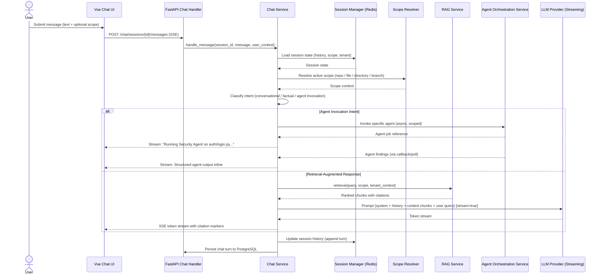

### Chat Session Management

Chat sessions are semi-persistent. Active session state (message history, scope, active repository, user preferences) is stored in Redis with a rolling TTL. On session resume, state is loaded from Redis; if expired, it is hydrated from PostgreSQL. This keeps the hot path low-latency while guaranteeing durability.

**History Windowing** — The LLM context window is finite. The Chat Service maintains a sliding window of the most recent N turns, summarizing older turns into a compressed context block using a summarization call when the window overflows. This enables 20+ turn conversations without context truncation.

**Scope Propagation** — When the user changes scope (e.g., narrows to a specific module), the Chat Service updates the session scope in Redis and prepends an explicit scope acknowledgment to the next assistant message. Scope changes do not reset conversation history.

**Agent Invocation from Chat** — The Chat Service classifies each incoming message. If an agent invocation is detected (via slash command or intent classifier), the Chat Service dispatches the relevant agent task via the Agent Orchestration Service and streams status updates back to the user as the agent executes. The final structured output is rendered inline in the chat thread with a distinct visual treatment.

---

## 10. Event Flow

The platform uses domain events to decouple modules. Events are published by application services and consumed by other services or Celery tasks.

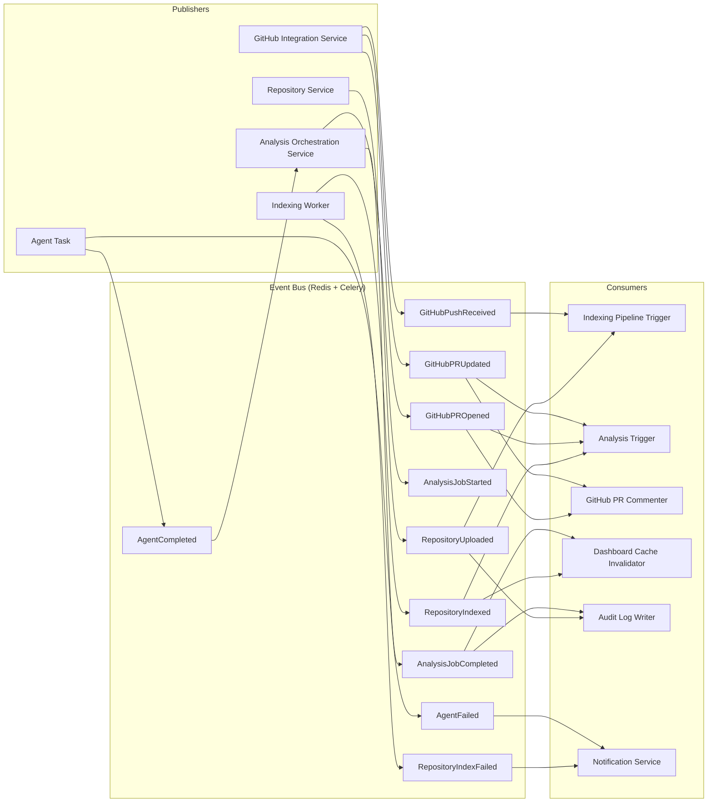

### Key Event Flows

**Repository Upload → Indexing → Analysis:** `RepositoryUploaded` triggers the indexing pipeline. `RepositoryIndexed` triggers auto-analysis if configured. `AnalysisJobCompleted` invalidates the dashboard cache and notifies the user.

**GitHub Push → Incremental Reindex:** `GitHubPushReceived` triggers a scoped incremental indexing job on changed files only. On completion, `RepositoryIndexed` is published, which triggers a background re-analysis if configured.

**GitHub PR → Automated Review:** `GitHubPROpened` or `GitHubPRUpdated` triggers a PR-scoped analysis using the diff as the analysis target. `AnalysisJobCompleted` triggers the GitHub PR Commenter, which formats findings as GitHub review comments and calls the GitHub API.

---

## 11. Folder Structure

```
ai-copilot-platform/
│
├── backend/                          # FastAPI Application
│   ├── app/
│   │   ├── main.py                   # FastAPI app factory, middleware registration
│   │   ├── config.py                 # Settings (Pydantic BaseSettings)
│   │   │
│   │   ├── domain/                   # Domain Layer — no framework deps
│   │   │   ├── entities/             # Core domain entities
│   │   │   │   ├── repository.py
│   │   │   │   ├── analysis_job.py
│   │   │   │   ├── agent_finding.py
│   │   │   │   ├── chat_session.py
│   │   │   │   ├── rag_chunk.py
│   │   │   │   ├── tenant.py
│   │   │   │   └── user.py
│   │   │   ├── events/               # Domain events
│   │   │   │   ├── repository_events.py
│   │   │   │   ├── analysis_events.py
│   │   │   │   └── github_events.py
│   │   │   ├── value_objects/        # Immutable domain values
│   │   │   │   ├── severity.py
│   │   │   │   ├── analysis_scope.py
│   │   │   │   └── tenant_id.py
│   │   │   └── interfaces/           # Abstract repository interfaces
│   │   │       ├── repository_repo.py
│   │   │       ├── analysis_repo.py
│   │   │       ├── finding_repo.py
│   │   │       ├── chat_repo.py
│   │   │       └── vector_repo.py
│   │   │
│   │   ├── application/              # Application Layer — use cases
│   │   │   ├── auth/
│   │   │   │   ├── auth_service.py
│   │   │   │   └── rbac_service.py
│   │   │   ├── repository/
│   │   │   │   ├── repository_service.py
│   │   │   │   └── ingestion_service.py
│   │   │   ├── analysis/
│   │   │   │   ├── analysis_orchestration_service.py
│   │   │   │   └── finding_service.py
│   │   │   ├── agents/
│   │   │   │   └── agent_orchestration_service.py
│   │   │   ├── rag/
│   │   │   │   ├── rag_service.py
│   │   │   │   ├── chunking_service.py
│   │   │   │   └── embedding_service.py
│   │   │   ├── chat/
│   │   │   │   ├── chat_service.py
│   │   │   │   └── session_service.py
│   │   │   ├── github/
│   │   │   │   ├── github_integration_service.py
│   │   │   │   └── pr_review_service.py
│   │   │   └── dashboard/
│   │   │       └── dashboard_service.py
│   │   │
│   │   ├── infrastructure/           # Infrastructure Layer — framework-aware
│   │   │   ├── db/
│   │   │   │   ├── models/           # SQLAlchemy ORM models
│   │   │   │   ├── repositories/     # Concrete repository implementations
│   │   │   │   └── session.py        # Async DB session factory
│   │   │   ├── vector/
│   │   │   │   ├── qdrant_client.py
│   │   │   │   └── qdrant_vector_repo.py
│   │   │   ├── cache/
│   │   │   │   ├── redis_client.py
│   │   │   │   └── cache_service.py
│   │   │   ├── storage/
│   │   │   │   └── object_storage_adapter.py
│   │   │   ├── llm/
│   │   │   │   ├── llm_adapter.py
│   │   │   │   └── embedding_adapter.py
│   │   │   ├── github/
│   │   │   │   └── github_api_adapter.py
│   │   │   └── tasks/               # Celery task definitions
│   │   │       ├── celery_app.py
│   │   │       ├── indexing_tasks.py
│   │   │       ├── analysis_tasks.py
│   │   │       └── github_tasks.py
│   │   │
│   │   ├── agents/                   # LangGraph Agent Implementations
│   │   │   ├── base/
│   │   │   │   ├── base_agent.py     # Abstract LangGraph agent base class
│   │   │   │   ├── agent_state.py    # Shared state schema
│   │   │   │   └── agent_nodes.py    # Shared node implementations
│   │   │   ├── architecture/
│   │   │   │   └── architecture_agent.py
│   │   │   ├── code_review/
│   │   │   │   └── code_review_agent.py
│   │   │   ├── bug_detection/
│   │   │   │   └── bug_detection_agent.py
│   │   │   ├── security/
│   │   │   │   └── security_agent.py
│   │   │   ├── documentation/
│   │   │   │   └── documentation_agent.py
│   │   │   ├── test_generation/
│   │   │   │   └── test_generation_agent.py
│   │   │   ├── issue_generation/
│   │   │   │   └── issue_generation_agent.py
│   │   │   └── refactoring/
│   │   │       └── refactoring_agent.py
│   │   │
│   │   └── interfaces/               # Interface Layer — HTTP boundary
│   │       ├── api/
│   │       │   ├── v1/
│   │       │   │   ├── auth.py
│   │       │   │   ├── repositories.py
│   │       │   │   ├── analysis.py
│   │       │   │   ├── chat.py
│   │       │   │   ├── agents.py
│   │       │   │   ├── github.py
│   │       │   │   ├── dashboard.py
│   │       │   │   └── tenants.py
│   │       │   └── webhooks/
│   │       │       └── github_webhook.py
│   │       ├── schemas/              # Pydantic request/response models
│   │       └── middleware/
│   │           ├── auth_middleware.py
│   │           ├── rbac_middleware.py
│   │           ├── tenant_middleware.py
│   │           └── audit_middleware.py
│   │
│   ├── tests/
│   │   ├── unit/
│   │   ├── integration/
│   │   └── e2e/
│   ├── Dockerfile
│   └── pyproject.toml
│
├── frontend/                         # Vue 3 SPA
│   ├── src/
│   │   ├── modules/
│   │   │   ├── auth/
│   │   │   ├── repositories/
│   │   │   ├── analysis/
│   │   │   ├── chat/
│   │   │   ├── agents/
│   │   │   ├── dashboard/
│   │   │   └── settings/
│   │   ├── shared/
│   │   │   ├── composables/
│   │   │   ├── components/
│   │   │   └── stores/               # Pinia stores
│   │   ├── router/
│   │   └── main.ts
│   ├── Dockerfile
│   └── package.json
│
├── docker/
│   ├── docker-compose.yml            # Local development stack
│   ├── docker-compose.prod.yml       # Production overrides
│   └── nginx/
│       └── nginx.conf
│
├── .github/
│   └── workflows/
│       ├── ci.yml                    # Test, lint, type-check
│       ├── build.yml                 # Docker image build and push
│       └── deploy.yml                # Deploy to target environment
│
└── infrastructure/                   # IaC (Terraform / Helm charts)
    ├── terraform/
    └── k8s/
```

---

## 12. Deployment Overview

The platform is containerized via Docker and deployable on Kubernetes. GitHub Actions drives the CI/CD pipeline with separate workflows for test, build, and deploy.

### Container Architecture

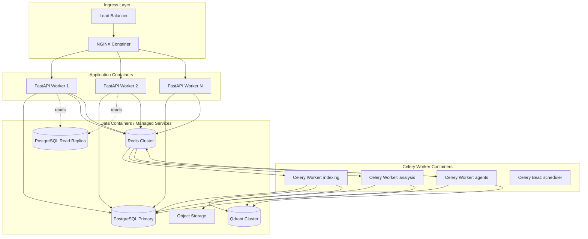

### CI/CD Pipeline (GitHub Actions)

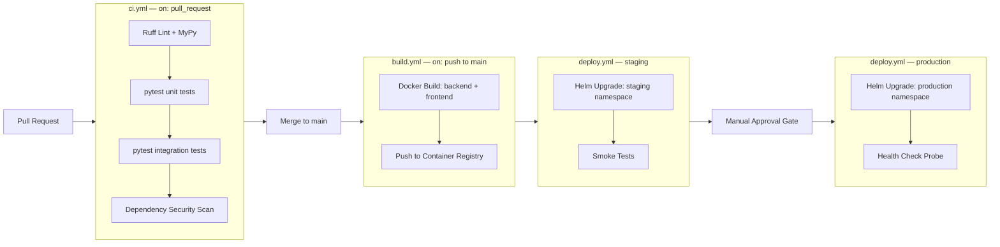

### Scaling Strategy

**API Workers** — Stateless FastAPI containers scale horizontally behind the load balancer. Kubernetes HPA scales based on CPU utilization and request queue depth.

**Celery Workers** — Worker pools are split by job type (indexing, analysis, agents). Each pool scales independently. Indexing and agent workers are compute-intensive and scale based on queue length. This prevents heavy analysis jobs from starving lightweight chat-related tasks.

**Qdrant** — Deployed as a cluster with sharding by tenant. Vector index storage scales independently of compute. Collections are partitioned per tenant to enforce data isolation and enable per-tenant index size monitoring.

**PostgreSQL** — Primary instance handles writes. A read replica handles dashboard queries, reporting, and audit log reads to reduce read pressure on the primary.

**Redis** — Deployed as a Redis Cluster for high availability. Separate logical databases for Celery broker, cache, and session state.

### Multi-Tenancy Isolation

Tenant isolation is enforced at every layer:

- **API Layer** — Tenant ID is extracted from the JWT on every request and injected into all downstream service calls via request context.
- **Database** — All PostgreSQL tables include a `tenant_id` column. Row-level filtering is applied in every repository query. No cross-tenant query is possible without an explicit tenant context.
- **Vector Store** — Qdrant collections are namespaced per tenant (`tenant_{id}_repo_{id}`). All Qdrant operations include a tenant-scoped collection reference.
- **Object Storage** — Repository artifacts are stored under tenant-prefixed paths.
- **Cache** — All Redis keys are prefixed with `tenant:{id}:` to prevent key collisions.

### Security Hardening

- All secrets (LLM API keys, GitHub App private keys, database credentials) are managed via a secrets manager (e.g., AWS Secrets Manager or Vault) and injected into containers at runtime. No secrets in environment variables committed to source.
- All inter-service communication inside the cluster is over TLS.
- Archive extraction (ZIP upload) runs in a sandboxed container with no network access and limited filesystem writes.
- NGINX enforces strict request size limits, header validation, and rate limiting before requests reach the application.
- All audit log writes are append-only and routed through a dedicated audit service that cannot be bypassed by application code.

---

*End of Architecture Document*

---

*This document reflects the system architecture for v1.0 of the AI-Powered Developer Copilot Platform. It is a living document and should be updated as the architecture evolves. All significant architectural changes require review by the lead architect and must be reflected here before implementation begins.*
