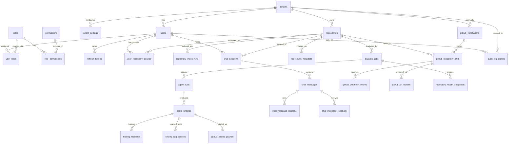

# Database Design Document

# AI-Powered Developer Copilot Platform

---

| Field             | Detail                                   |
|-------------------|------------------------------------------|
| Document Version  | 1.0                                      |
| Status            | Draft                                    |
| Product Name      | AI-Powered Developer Copilot Platform    |
| Document Type     | PostgreSQL Database Design               |
| Source Documents  | PRD v1.0, Architecture v1.0              |
| Last Updated      | June 2025                                |
| Classification    | Internal — Confidential                  |

---

## Table of Contents

1. Database Overview
2. Multi-Tenancy Strategy
3. Entity Relationship Diagram
4. Core Entities and Relationships
5. Authentication & RBAC Tables
6. Tenant Management Tables
7. Repository Management Tables
8. Analysis & Agent Tables
9. RAG Metadata Tables
10. Chat System Tables
11. GitHub Integration Tables
12. Dashboard & Analytics Tables
13. Audit & Logging Tables
14. Indexing Strategy
15. Partitioning Strategy
16. Data Retention Strategy
17. Scalability Considerations

---

## 1. Database Overview

PostgreSQL is the primary relational store for the AI-Powered Developer Copilot Platform. It holds all structured, persistent state: tenants, users, roles and permissions, repositories (metadata only — raw content lives in object storage), analysis jobs, agent findings, GitHub integration state, chat session metadata, RAG chunk metadata, dashboard metrics snapshots, and audit logs.

All access to PostgreSQL is mediated by SQLAlchemy async sessions through concrete repository implementations that satisfy domain repository interfaces. No service class ever holds a direct reference to a session or executes raw SQL — all queries go through the repository pattern.

### Design Commitments

- Every tenant-scoped table carries a non-nullable `tenant_id` foreign key. Row-level filtering on `tenant_id` is applied in every repository query with no exceptions.
- All primary keys are `UUID` (version 4), generated application-side before insert, to avoid sequential integer enumeration attacks and to support distributed ID generation.
- All tables carry `created_at` and `updated_at` timestamps (with time zone) managed by the application layer (not database triggers) to ensure auditability and portability.
- Soft-deletion (`deleted_at TIMESTAMPTZ`) is used on entities where data must be recoverable or referenced by immutable audit records. Hard deletion is used only after retention policies are enforced.
- All enum-typed columns use PostgreSQL native `ENUM` types defined as named domain types, or `VARCHAR` with a `CHECK` constraint — to be determined per-column based on expected cardinality and migration agility needs.

### PostgreSQL Version

PostgreSQL 15+ is required for `MERGE` statement support, improved `JSONB` indexing, and declarative partitioning enhancements.

---

## 2. Multi-Tenancy Strategy

The platform uses a **shared-database, shared-schema** multi-tenancy model with tenant isolation enforced entirely at the application and query layer. This approach was chosen to maximize operational simplicity, reduce infrastructure cost per tenant, and support up to 10,000 concurrent authenticated users across all organizations.

### Isolation Enforcement

Every table that stores tenant-scoped data carries a `tenant_id UUID NOT NULL` column with a foreign key to `tenants.id`. The SQLAlchemy repository base class injects a `WHERE tenant_id = :tenant_id` clause on every read, update, and delete operation. No cross-tenant query is possible without an explicit, authenticated tenant context — enforced at the application layer boundary.

### Tenant ID Propagation

Tenant ID is extracted from the JWT on every API request and injected into a request-scoped context object. All application service methods receive this context as a required parameter. The infrastructure repository implementations read the tenant ID from this context and apply it as a filter. Services cannot call repository methods without providing tenant context.

### Data Isolation at Other Layers

- **Qdrant**: Collections are namespaced per tenant and repository (`tenant_{id}_repo_{id}`).
- **Object Storage**: Repository artifacts are stored under `{tenant_id}/{repository_id}/` prefixed paths.
- **Redis**: All keys are prefixed `tenant:{id}:` to prevent cache key collisions.

---

## 3. Entity Relationship Diagram

---

## 4. Core Entities and Relationships

The database is organized into nine functional domains:

- **Auth & RBAC** — users, roles, permissions, tokens
- **Tenant Management** — tenants, settings, plan configuration
- **Repository Management** — repositories, index runs, access control
- **Analysis & Agents** — analysis jobs, agent runs, findings, feedback
- **RAG Metadata** — chunk metadata, embedding records (vector payload stored in Qdrant)
- **Chat System** — sessions, messages, citations, feedback
- **GitHub Integration** — installations, repository links, webhook events, PR reviews
- **Dashboard & Analytics** — health snapshots, aggregated metrics
- **Audit & Logging** — immutable audit trail

All cross-domain relationships use `tenant_id` as a co-filter on foreign key joins to prevent cross-tenant data leakage even in the event of application logic bugs.

---

## 5. Authentication & RBAC Tables

### `users`

**Purpose:** Stores all user accounts across all tenants. A user belongs to exactly one tenant. Authentication state (password hash, OAuth identity) is stored here.

| Column             | Type                    | Constraints / Notes                               |
|--------------------|-------------------------|---------------------------------------------------|
| `id`               | `UUID`                  | PK, default `gen_random_uuid()`                   |
| `tenant_id`        | `UUID`                  | FK → `tenants.id`, NOT NULL                       |
| `email`            | `VARCHAR(320)`          | NOT NULL, UNIQUE within tenant (partial unique index) |
| `display_name`     | `VARCHAR(255)`          | NOT NULL                                          |
| `password_hash`    | `VARCHAR(255)`          | NULLABLE (null when OAuth-only user)              |
| `auth_provider`    | `VARCHAR(50)`           | `'local'`, `'github'`, `'google'`; NOT NULL       |
| `auth_provider_id` | `VARCHAR(255)`          | NULLABLE; external OAuth subject ID               |
| `is_active`        | `BOOLEAN`               | NOT NULL, DEFAULT `TRUE`                          |
| `is_email_verified`| `BOOLEAN`               | NOT NULL, DEFAULT `FALSE`                         |
| `last_login_at`    | `TIMESTAMPTZ`           | NULLABLE                                          |
| `failed_login_count`| `SMALLINT`             | NOT NULL, DEFAULT `0`                             |
| `locked_until`     | `TIMESTAMPTZ`           | NULLABLE; rate-limit lockout expiry               |
| `created_at`       | `TIMESTAMPTZ`           | NOT NULL, DEFAULT `now()`                         |
| `updated_at`       | `TIMESTAMPTZ`           | NOT NULL, DEFAULT `now()`                         |
| `deleted_at`       | `TIMESTAMPTZ`           | NULLABLE; soft-delete                             |

**Primary Key:** `id`
**Foreign Keys:** `tenant_id` → `tenants.id`
**Constraints:**
- `UNIQUE (tenant_id, email)` — email uniqueness is scoped per tenant
- `CHECK (auth_provider IN ('local', 'github', 'google'))`
- `CHECK (deleted_at IS NULL OR deleted_at > created_at)`

**Indexes:**
- `idx_users_tenant_id` on `(tenant_id)`
- `idx_users_email_tenant` on `(tenant_id, email)` — unique, WHERE `deleted_at IS NULL`
- `idx_users_auth_provider_id` on `(auth_provider, auth_provider_id)` WHERE `auth_provider_id IS NOT NULL`

---

### `roles`

**Purpose:** System-defined roles available across all tenants. Contains the three platform roles: `admin`, `team_lead`, `developer`. Roles are global (not tenant-scoped) since they are platform-defined.

| Column        | Type           | Constraints / Notes              |
|---------------|----------------|----------------------------------|
| `id`          | `UUID`         | PK                               |
| `name`        | `VARCHAR(100)` | NOT NULL, UNIQUE                 |
| `display_name`| `VARCHAR(255)` | NOT NULL                         |
| `description` | `TEXT`         | NULLABLE                         |
| `is_system`   | `BOOLEAN`      | NOT NULL, DEFAULT `TRUE`         |
| `created_at`  | `TIMESTAMPTZ`  | NOT NULL, DEFAULT `now()`        |

**Primary Key:** `id`
**Constraints:** `UNIQUE (name)`

---

### `permissions`

**Purpose:** Granular permission definitions. Each permission represents a specific action-resource pair (e.g., `repository:upload`, `analysis:trigger_full`, `user:manage`). Used to build the RBAC enforcement matrix in the application layer.

| Column        | Type           | Constraints / Notes              |
|---------------|----------------|----------------------------------|
| `id`          | `UUID`         | PK                               |
| `name`        | `VARCHAR(150)` | NOT NULL, UNIQUE; e.g., `repository:delete` |
| `resource`    | `VARCHAR(100)` | NOT NULL; e.g., `repository`     |
| `action`      | `VARCHAR(100)` | NOT NULL; e.g., `delete`         |
| `description` | `TEXT`         | NULLABLE                         |
| `created_at`  | `TIMESTAMPTZ`  | NOT NULL, DEFAULT `now()`        |

**Primary Key:** `id`
**Constraints:** `UNIQUE (resource, action)`

---

### `role_permissions`

**Purpose:** Many-to-many join table mapping roles to the permissions they grant. The application layer loads this mapping at startup (or from cache) to enforce RBAC without per-request DB queries.

| Column          | Type          | Constraints / Notes    |
|-----------------|---------------|------------------------|
| `role_id`       | `UUID`        | FK → `roles.id`, NOT NULL |
| `permission_id` | `UUID`        | FK → `permissions.id`, NOT NULL |

**Primary Key:** `(role_id, permission_id)` (composite)
**Foreign Keys:** `role_id` → `roles.id`, `permission_id` → `permissions.id`

---

### `user_roles`

**Purpose:** Assigns a role to a user within a tenant. A user may hold one role at the tenant level (as per the PRD's three-role model) but the schema supports multiple roles for forward-compatibility.

| Column       | Type          | Constraints / Notes              |
|--------------|---------------|----------------------------------|
| `id`         | `UUID`        | PK                               |
| `tenant_id`  | `UUID`        | FK → `tenants.id`, NOT NULL      |
| `user_id`    | `UUID`        | FK → `users.id`, NOT NULL        |
| `role_id`    | `UUID`        | FK → `roles.id`, NOT NULL        |
| `granted_by` | `UUID`        | FK → `users.id`, NULLABLE (null for system-assigned roles) |
| `granted_at` | `TIMESTAMPTZ` | NOT NULL, DEFAULT `now()`        |
| `revoked_at` | `TIMESTAMPTZ` | NULLABLE                         |

**Primary Key:** `id`
**Foreign Keys:** `tenant_id` → `tenants.id`, `user_id` → `users.id`, `role_id` → `roles.id`, `granted_by` → `users.id`
**Constraints:** `UNIQUE (tenant_id, user_id, role_id)` WHERE `revoked_at IS NULL`

**Indexes:**
- `idx_user_roles_user_tenant` on `(user_id, tenant_id)` WHERE `revoked_at IS NULL`

---

### `refresh_tokens`

**Purpose:** Stores hashed refresh tokens for JWT refresh token rotation. Short-lived access tokens (15 min) are not stored. Refresh tokens (7 days) are stored hashed and rotated on every use.

| Column        | Type           | Constraints / Notes                        |
|---------------|----------------|--------------------------------------------|
| `id`          | `UUID`         | PK                                         |
| `tenant_id`   | `UUID`         | FK → `tenants.id`, NOT NULL                |
| `user_id`     | `UUID`         | FK → `users.id`, NOT NULL                  |
| `token_hash`  | `VARCHAR(255)` | NOT NULL, UNIQUE; SHA-256 of raw token      |
| `family_id`   | `UUID`         | NOT NULL; reuse-detection: all rotations of one token share a family |
| `expires_at`  | `TIMESTAMPTZ`  | NOT NULL                                   |
| `revoked_at`  | `TIMESTAMPTZ`  | NULLABLE                                   |
| `user_agent`  | `VARCHAR(500)` | NULLABLE                                   |
| `ip_address`  | `INET`         | NULLABLE                                   |
| `created_at`  | `TIMESTAMPTZ`  | NOT NULL, DEFAULT `now()`                  |

**Primary Key:** `id`
**Foreign Keys:** `tenant_id` → `tenants.id`, `user_id` → `users.id`
**Constraints:** `UNIQUE (token_hash)`

**Indexes:**
- `idx_refresh_tokens_user` on `(user_id)` WHERE `revoked_at IS NULL AND expires_at > now()`
- `idx_refresh_tokens_family` on `(family_id)` — for reuse detection

---

## 6. Tenant Management Tables

### `tenants`

**Purpose:** Represents an organization (tenant) on the platform. Every user, repository, and analysis result is scoped to a tenant.

| Column          | Type           | Constraints / Notes                    |
|-----------------|----------------|----------------------------------------|
| `id`            | `UUID`         | PK                                     |
| `slug`          | `VARCHAR(100)` | NOT NULL, UNIQUE; URL-safe org identifier |
| `display_name`  | `VARCHAR(255)` | NOT NULL                               |
| `plan`          | `VARCHAR(50)`  | NOT NULL, DEFAULT `'free'`; `'free'`, `'pro'`, `'enterprise'` |
| `is_active`     | `BOOLEAN`      | NOT NULL, DEFAULT `TRUE`               |
| `max_repositories` | `INTEGER`   | NOT NULL, DEFAULT `10`; plan-enforced limit |
| `max_users`     | `INTEGER`      | NOT NULL, DEFAULT `5`; plan-enforced limit |
| `data_region`   | `VARCHAR(20)`  | NOT NULL, DEFAULT `'us'`; `'us'`, `'eu'` |
| `created_at`    | `TIMESTAMPTZ`  | NOT NULL, DEFAULT `now()`              |
| `updated_at`    | `TIMESTAMPTZ`  | NOT NULL, DEFAULT `now()`              |
| `deleted_at`    | `TIMESTAMPTZ`  | NULLABLE; soft-delete                  |

**Primary Key:** `id`
**Constraints:**
- `UNIQUE (slug)`
- `CHECK (plan IN ('free', 'pro', 'enterprise'))`
- `CHECK (data_region IN ('us', 'eu'))`

**Indexes:**
- `idx_tenants_slug` on `(slug)` WHERE `deleted_at IS NULL`

---

### `tenant_settings`

**Purpose:** Stores per-tenant configuration: AI agent toggles, severity thresholds, API rate limits, notification preferences, and analysis behavior settings. This enables admin-configurable behavior without code deployments.

| Column                    | Type          | Constraints / Notes                         |
|---------------------------|---------------|---------------------------------------------|
| `id`                      | `UUID`        | PK                                          |
| `tenant_id`               | `UUID`        | FK → `tenants.id`, NOT NULL, UNIQUE         |
| `enabled_agents`          | `JSONB`       | NOT NULL, DEFAULT `'{"architecture":true,"code_review":true,"bug_detection":true,"security":true,"documentation":true,"test_generation":true,"issue_generation":true,"refactoring":true}'` |
| `severity_thresholds`     | `JSONB`       | NOT NULL; per-agent severity overrides       |
| `pr_review_enabled`       | `BOOLEAN`     | NOT NULL, DEFAULT `TRUE`                    |
| `pr_block_on_critical`    | `BOOLEAN`     | NOT NULL, DEFAULT `FALSE`                   |
| `auto_analysis_on_push`   | `BOOLEAN`     | NOT NULL, DEFAULT `TRUE`                    |
| `auto_analysis_on_pr`     | `BOOLEAN`     | NOT NULL, DEFAULT `TRUE`                    |
| `api_rate_limit_per_min`  | `INTEGER`     | NOT NULL, DEFAULT `60`                      |
| `chat_session_ttl_hours`  | `INTEGER`     | NOT NULL, DEFAULT `24`                      |
| `analysis_retention_days` | `INTEGER`     | NOT NULL, DEFAULT `365`                     |
| `updated_at`              | `TIMESTAMPTZ` | NOT NULL, DEFAULT `now()`                   |
| `updated_by`              | `UUID`        | FK → `users.id`, NULLABLE                   |

**Primary Key:** `id`
**Foreign Keys:** `tenant_id` → `tenants.id`, `updated_by` → `users.id`
**Constraints:** `UNIQUE (tenant_id)`

---

### `user_repository_access`

**Purpose:** Grants a specific user access to a specific repository. Used when repository-level permissions restrict beyond the tenant-level role (e.g., a Developer only seeing their assigned repositories).

| Column          | Type          | Constraints / Notes              |
|-----------------|---------------|----------------------------------|
| `id`            | `UUID`        | PK                               |
| `tenant_id`     | `UUID`        | FK → `tenants.id`, NOT NULL      |
| `user_id`       | `UUID`        | FK → `users.id`, NOT NULL        |
| `repository_id` | `UUID`        | FK → `repositories.id`, NOT NULL |
| `access_level`  | `VARCHAR(50)` | NOT NULL; `'read'`, `'write'`    |
| `granted_by`    | `UUID`        | FK → `users.id`, NULLABLE        |
| `granted_at`    | `TIMESTAMPTZ` | NOT NULL, DEFAULT `now()`        |
| `revoked_at`    | `TIMESTAMPTZ` | NULLABLE                         |

**Primary Key:** `id`
**Foreign Keys:** `tenant_id` → `tenants.id`, `user_id` → `users.id`, `repository_id` → `repositories.id`, `granted_by` → `users.id`
**Constraints:** `UNIQUE (tenant_id, user_id, repository_id)` WHERE `revoked_at IS NULL`

**Indexes:**
- `idx_repo_access_user` on `(user_id, tenant_id)` WHERE `revoked_at IS NULL`
- `idx_repo_access_repo` on `(repository_id, tenant_id)` WHERE `revoked_at IS NULL`

---

## 7. Repository Management Tables

### `repositories`

**Purpose:** Central metadata record for every repository connected to the platform, whether uploaded as a ZIP archive or connected via GitHub. Raw source content lives in object storage; this table holds only structural metadata and state.

| Column                | Type           | Constraints / Notes                               |
|-----------------------|----------------|---------------------------------------------------|
| `id`                  | `UUID`         | PK                                                |
| `tenant_id`           | `UUID`         | FK → `tenants.id`, NOT NULL                       |
| `name`                | `VARCHAR(255)` | NOT NULL                                          |
| `description`         | `TEXT`         | NULLABLE                                          |
| `source_type`         | `VARCHAR(20)`  | NOT NULL; `'zip'`, `'github'`                     |
| `primary_language`    | `VARCHAR(100)` | NULLABLE                                          |
| `detected_languages`  | `JSONB`        | NULLABLE; `["Python","TypeScript"]`               |
| `index_status`        | `VARCHAR(30)`  | NOT NULL, DEFAULT `'pending'`; `'pending'`, `'indexing'`, `'ready'`, `'error'`, `'stale'` |
| `index_error_message` | `TEXT`         | NULLABLE                                          |
| `last_indexed_at`     | `TIMESTAMPTZ`  | NULLABLE                                          |
| `last_analysis_at`    | `TIMESTAMPTZ`  | NULLABLE                                          |
| `total_files`         | `INTEGER`      | NULLABLE                                          |
| `total_lines_of_code` | `INTEGER`      | NULLABLE                                          |
| `total_chunks`        | `INTEGER`      | NULLABLE; count of Qdrant vectors                 |
| `storage_path_prefix` | `VARCHAR(500)` | NOT NULL; object storage path prefix              |
| `default_branch`      | `VARCHAR(255)` | NULLABLE; populated for GitHub-sourced repos      |
| `is_active`           | `BOOLEAN`      | NOT NULL, DEFAULT `TRUE`                          |
| `created_by`          | `UUID`         | FK → `users.id`, NOT NULL                        |
| `created_at`          | `TIMESTAMPTZ`  | NOT NULL, DEFAULT `now()`                         |
| `updated_at`          | `TIMESTAMPTZ`  | NOT NULL, DEFAULT `now()`                         |
| `deleted_at`          | `TIMESTAMPTZ`  | NULLABLE; soft-delete; triggers async cleanup job |

**Primary Key:** `id`
**Foreign Keys:** `tenant_id` → `tenants.id`, `created_by` → `users.id`
**Constraints:**
- `CHECK (source_type IN ('zip', 'github'))`
- `CHECK (index_status IN ('pending', 'indexing', 'ready', 'error', 'stale'))`

**Indexes:**
- `idx_repositories_tenant` on `(tenant_id)` WHERE `deleted_at IS NULL`
- `idx_repositories_tenant_status` on `(tenant_id, index_status)` WHERE `deleted_at IS NULL`
- `idx_repositories_deleted` on `(deleted_at)` WHERE `deleted_at IS NOT NULL` — cleanup job sweep

---

### `repository_index_runs`

**Purpose:** Tracks every execution of the indexing pipeline for a repository. Provides a full history of index builds including duration, chunk counts, and error details. Used to compute index freshness and diagnose indexing failures.

| Column              | Type          | Constraints / Notes                            |
|---------------------|---------------|------------------------------------------------|
| `id`                | `UUID`        | PK                                             |
| `tenant_id`         | `UUID`        | FK → `tenants.id`, NOT NULL                    |
| `repository_id`     | `UUID`        | FK → `repositories.id`, NOT NULL               |
| `trigger`           | `VARCHAR(50)` | NOT NULL; `'manual'`, `'github_push'`, `'initial'`, `'scheduled'` |
| `index_type`        | `VARCHAR(20)` | NOT NULL; `'full'`, `'incremental'`            |
| `status`            | `VARCHAR(20)` | NOT NULL; `'running'`, `'completed'`, `'failed'`, `'cancelled'` |
| `started_at`        | `TIMESTAMPTZ` | NOT NULL, DEFAULT `now()`                      |
| `completed_at`      | `TIMESTAMPTZ` | NULLABLE                                       |
| `files_processed`   | `INTEGER`     | NULLABLE                                       |
| `files_skipped`     | `INTEGER`     | NULLABLE                                       |
| `chunks_created`    | `INTEGER`     | NULLABLE                                       |
| `chunks_updated`    | `INTEGER`     | NULLABLE                                       |
| `chunks_deleted`    | `INTEGER`     | NULLABLE                                       |
| `error_message`     | `TEXT`        | NULLABLE                                       |
| `celery_task_id`    | `VARCHAR(255)`| NULLABLE                                       |
| `git_commit_sha`    | `VARCHAR(40)` | NULLABLE; HEAD commit at time of index         |
| `changed_files`     | `JSONB`       | NULLABLE; list of changed file paths (incremental only) |

**Primary Key:** `id`
**Foreign Keys:** `tenant_id` → `tenants.id`, `repository_id` → `repositories.id`

**Indexes:**
- `idx_index_runs_repo` on `(repository_id, started_at DESC)`
- `idx_index_runs_tenant_status` on `(tenant_id, status)` WHERE `status = 'running'`
- `idx_index_runs_celery` on `(celery_task_id)` WHERE `celery_task_id IS NOT NULL`

---

## 8. Analysis & Agent Tables

### `analysis_jobs`

**Purpose:** Top-level record for each analysis execution. An analysis job coordinates all agent runs for a given repository at a point in time. It is the unit of work that the Analysis Orchestration Service creates, monitors, and finalizes.

| Column                 | Type           | Constraints / Notes                                 |
|------------------------|----------------|-----------------------------------------------------|
| `id`                   | `UUID`         | PK                                                  |
| `tenant_id`            | `UUID`         | FK → `tenants.id`, NOT NULL                         |
| `repository_id`        | `UUID`         | FK → `repositories.id`, NOT NULL                    |
| `trigger`              | `VARCHAR(50)`  | NOT NULL; `'manual'`, `'github_push'`, `'github_pr'`, `'scheduled'`, `'post_index'` |
| `analysis_type`        | `VARCHAR(20)`  | NOT NULL; `'full'`, `'incremental'`, `'pr'`         |
| `status`               | `VARCHAR(20)`  | NOT NULL, DEFAULT `'pending'`; `'pending'`, `'running'`, `'completed'`, `'partial'`, `'failed'` |
| `scope`                | `JSONB`        | NULLABLE; `{"type":"pr","pr_number":42,"diff_files":["..."]}` |
| `triggered_by`         | `UUID`         | FK → `users.id`, NULLABLE (null for automated)      |
| `celery_group_id`      | `VARCHAR(255)` | NULLABLE                                            |
| `started_at`           | `TIMESTAMPTZ`  | NULLABLE                                            |
| `completed_at`         | `TIMESTAMPTZ`  | NULLABLE                                            |
| `total_findings`       | `INTEGER`      | NULLABLE; computed after all agents complete        |
| `critical_findings`    | `INTEGER`      | NULLABLE                                            |
| `high_findings`        | `INTEGER`      | NULLABLE                                            |
| `composite_health_score` | `NUMERIC(5,2)` | NULLABLE; 0–100                                   |
| `git_commit_sha`       | `VARCHAR(40)`  | NULLABLE; HEAD commit at analysis time              |
| `error_message`        | `TEXT`         | NULLABLE                                            |
| `created_at`           | `TIMESTAMPTZ`  | NOT NULL, DEFAULT `now()`                           |

**Primary Key:** `id`
**Foreign Keys:** `tenant_id` → `tenants.id`, `repository_id` → `repositories.id`, `triggered_by` → `users.id`
**Constraints:** `CHECK (status IN ('pending','running','completed','partial','failed'))`

**Indexes:**
- `idx_analysis_jobs_repo` on `(repository_id, created_at DESC)`
- `idx_analysis_jobs_tenant_status` on `(tenant_id, status)` WHERE `status IN ('pending','running')`
- `idx_analysis_jobs_tenant_created` on `(tenant_id, created_at DESC)` — dashboard queries

---

### `agent_runs`

**Purpose:** Tracks the execution of each individual AI agent within an analysis job. One analysis job spawns up to eight agent runs (one per enabled agent), all dispatched concurrently via a Celery group. Agent failures are isolated — one failed agent run does not cancel siblings.

| Column              | Type           | Constraints / Notes                          |
|---------------------|----------------|----------------------------------------------|
| `id`                | `UUID`         | PK                                           |
| `tenant_id`         | `UUID`         | FK → `tenants.id`, NOT NULL                  |
| `analysis_job_id`   | `UUID`         | FK → `analysis_jobs.id`, NOT NULL            |
| `repository_id`     | `UUID`         | FK → `repositories.id`, NOT NULL             |
| `agent_type`        | `VARCHAR(50)`  | NOT NULL; `'architecture'`, `'code_review'`, `'bug_detection'`, `'security'`, `'documentation'`, `'test_generation'`, `'issue_generation'`, `'refactoring'` |
| `status`            | `VARCHAR(20)`  | NOT NULL, DEFAULT `'pending'`; `'pending'`, `'running'`, `'completed'`, `'failed'`, `'skipped'` |
| `celery_task_id`    | `VARCHAR(255)` | NULLABLE                                     |
| `started_at`        | `TIMESTAMPTZ`  | NULLABLE                                     |
| `completed_at`      | `TIMESTAMPTZ`  | NULLABLE                                     |
| `duration_ms`       | `INTEGER`      | NULLABLE; computed from start/complete delta |
| `findings_count`    | `INTEGER`      | NULLABLE                                     |
| `rag_queries_count` | `INTEGER`      | NULLABLE; number of RAG retrievals performed |
| `llm_tokens_used`   | `INTEGER`      | NULLABLE; total tokens consumed              |
| `retry_count`       | `SMALLINT`     | NOT NULL, DEFAULT `0`                        |
| `error_message`     | `TEXT`         | NULLABLE                                     |
| `agent_config_snapshot` | `JSONB`   | NULLABLE; copy of agent configuration at run time |

**Primary Key:** `id`
**Foreign Keys:** `tenant_id` → `tenants.id`, `analysis_job_id` → `analysis_jobs.id`, `repository_id` → `repositories.id`
**Constraints:**
- `UNIQUE (analysis_job_id, agent_type)` — one agent run per type per job
- `CHECK (agent_type IN ('architecture','code_review','bug_detection','security','documentation','test_generation','issue_generation','refactoring'))`
- `CHECK (status IN ('pending','running','completed','failed','skipped'))`

**Indexes:**
- `idx_agent_runs_job` on `(analysis_job_id)`
- `idx_agent_runs_repo_type` on `(repository_id, agent_type, started_at DESC)`

---

### `agent_findings`

**Purpose:** Each individual finding produced by an agent run. A finding represents a specific, file-level issue identified by an agent: a bug, security vulnerability, architectural problem, documentation gap, refactoring opportunity, etc.

| Column                  | Type           | Constraints / Notes                              |
|-------------------------|----------------|--------------------------------------------------|
| `id`                    | `UUID`         | PK                                               |
| `tenant_id`             | `UUID`         | FK → `tenants.id`, NOT NULL                      |
| `agent_run_id`          | `UUID`         | FK → `agent_runs.id`, NOT NULL                   |
| `repository_id`         | `UUID`         | FK → `repositories.id`, NOT NULL                 |
| `agent_type`            | `VARCHAR(50)`  | NOT NULL; denormalized for query performance     |
| `title`                 | `VARCHAR(500)` | NOT NULL                                         |
| `description`           | `TEXT`         | NOT NULL                                         |
| `category`              | `VARCHAR(100)` | NOT NULL; e.g., `'null_dereference'`, `'sql_injection'`, `'circular_dependency'` |
| `severity`              | `VARCHAR(20)`  | NOT NULL; `'critical'`, `'high'`, `'medium'`, `'low'`, `'informational'` |
| `confidence_score`      | `SMALLINT`     | NOT NULL; 0–100                                  |
| `file_path`             | `VARCHAR(1000)`| NOT NULL                                         |
| `line_start`            | `INTEGER`      | NULLABLE                                         |
| `line_end`              | `INTEGER`      | NULLABLE                                         |
| `function_name`         | `VARCHAR(500)` | NULLABLE                                         |
| `class_name`            | `VARCHAR(500)` | NULLABLE                                         |
| `remediation`           | `TEXT`         | NULLABLE                                         |
| `remediation_code`      | `TEXT`         | NULLABLE; concrete code example                  |
| `cwe_id`                | `VARCHAR(20)`  | NULLABLE; e.g., `'CWE-89'` (security agent)      |
| `owasp_category`        | `VARCHAR(100)` | NULLABLE                                         |
| `status`                | `VARCHAR(30)`  | NOT NULL, DEFAULT `'open'`; `'open'`, `'resolved'`, `'false_positive'`, `'accepted_risk'` |
| `resolved_at`           | `TIMESTAMPTZ`  | NULLABLE                                         |
| `resolved_by`           | `UUID`         | FK → `users.id`, NULLABLE                        |
| `is_new`                | `BOOLEAN`      | NOT NULL, DEFAULT `TRUE`; FALSE if same finding existed in prior run |
| `fingerprint`           | `VARCHAR(64)`  | NOT NULL; deterministic hash for deduplication   |
| `created_at`            | `TIMESTAMPTZ`  | NOT NULL, DEFAULT `now()`                        |
| `updated_at`            | `TIMESTAMPTZ`  | NOT NULL, DEFAULT `now()`                        |

**Primary Key:** `id`
**Foreign Keys:** `tenant_id` → `tenants.id`, `agent_run_id` → `agent_runs.id`, `repository_id` → `repositories.id`, `resolved_by` → `users.id`
**Constraints:**
- `CHECK (severity IN ('critical','high','medium','low','informational'))`
- `CHECK (status IN ('open','resolved','false_positive','accepted_risk'))`
- `CHECK (confidence_score BETWEEN 0 AND 100)`

**Indexes:**
- `idx_findings_repo_severity` on `(repository_id, severity, status)` WHERE `status = 'open'`
- `idx_findings_tenant_status` on `(tenant_id, status, created_at DESC)`
- `idx_findings_fingerprint` on `(repository_id, fingerprint)` — deduplication lookups
- `idx_findings_agent_run` on `(agent_run_id)`
- `idx_findings_file` on `(repository_id, file_path)` WHERE `status = 'open'`

---

### `finding_feedback`

**Purpose:** Records user feedback on individual findings (accept, reject, mark as false positive). This data feeds back into the model improvement pipeline and is used to compute per-agent false positive rates for the AI Analytics Dashboard.

| Column         | Type          | Constraints / Notes                          |
|----------------|---------------|----------------------------------------------|
| `id`           | `UUID`        | PK                                           |
| `tenant_id`    | `UUID`        | FK → `tenants.id`, NOT NULL                  |
| `finding_id`   | `UUID`        | FK → `agent_findings.id`, NOT NULL           |
| `user_id`      | `UUID`        | FK → `users.id`, NOT NULL                    |
| `feedback_type`| `VARCHAR(30)` | NOT NULL; `'accepted'`, `'rejected'`, `'false_positive'`, `'accepted_risk'` |
| `comment`      | `TEXT`        | NULLABLE                                     |
| `created_at`   | `TIMESTAMPTZ` | NOT NULL, DEFAULT `now()`                    |

**Primary Key:** `id`
**Foreign Keys:** `tenant_id` → `tenants.id`, `finding_id` → `agent_findings.id`, `user_id` → `users.id`
**Constraints:** `UNIQUE (finding_id, user_id)` — one feedback entry per user per finding

**Indexes:**
- `idx_finding_feedback_finding` on `(finding_id)`
- `idx_finding_feedback_tenant` on `(tenant_id, feedback_type, created_at DESC)`

---

### `finding_rag_sources`

**Purpose:** Records which RAG-retrieved chunks informed a specific finding, enabling traceability from finding to source context. Required by the PRD traceability requirement: "every finding must be traceable to the specific RAG-retrieved context that informed it."

| Column           | Type           | Constraints / Notes                        |
|------------------|----------------|--------------------------------------------|
| `id`             | `UUID`         | PK                                         |
| `tenant_id`      | `UUID`         | FK → `tenants.id`, NOT NULL                |
| `finding_id`     | `UUID`         | FK → `agent_findings.id`, NOT NULL         |
| `chunk_id`       | `UUID`         | FK → `rag_chunk_metadata.id`, NOT NULL     |
| `relevance_score`| `NUMERIC(5,4)` | NULLABLE                                   |
| `retrieval_rank` | `SMALLINT`     | NULLABLE; position in retrieval result set |

**Primary Key:** `id`
**Foreign Keys:** `tenant_id` → `tenants.id`, `finding_id` → `agent_findings.id`, `chunk_id` → `rag_chunk_metadata.id`

**Indexes:**
- `idx_finding_rag_sources_finding` on `(finding_id)`

---

## 9. RAG Metadata Tables

The vector embeddings and semantic payloads live in Qdrant. PostgreSQL stores chunk metadata: structural information, file location, and status. This enables SQL-based queries over the index (e.g., "how many chunks exist for this file?" or "mark all chunks for deleted files as stale") without round-tripping to the vector store.

### `rag_chunk_metadata`

**Purpose:** Metadata record for every chunk in the Qdrant vector index. The `qdrant_point_id` column is the foreign key into Qdrant — each row here corresponds to exactly one vector point in the tenant-repository Qdrant collection.

| Column               | Type           | Constraints / Notes                              |
|----------------------|----------------|--------------------------------------------------|
| `id`                 | `UUID`         | PK; also used as `qdrant_point_id`               |
| `tenant_id`          | `UUID`         | FK → `tenants.id`, NOT NULL                      |
| `repository_id`      | `UUID`         | FK → `repositories.id`, NOT NULL                 |
| `index_run_id`       | `UUID`         | FK → `repository_index_runs.id`, NOT NULL        |
| `file_path`          | `VARCHAR(1000)`| NOT NULL                                         |
| `language`           | `VARCHAR(50)`  | NULLABLE                                         |
| `chunk_type`         | `VARCHAR(30)`  | NOT NULL; `'function'`, `'class'`, `'module'`, `'documentation'`, `'config'` |
| `function_name`      | `VARCHAR(500)` | NULLABLE                                         |
| `class_name`         | `VARCHAR(500)` | NULLABLE                                         |
| `line_start`         | `INTEGER`      | NOT NULL                                         |
| `line_end`           | `INTEGER`      | NOT NULL                                         |
| `char_count`         | `INTEGER`      | NULLABLE                                         |
| `token_count`        | `INTEGER`      | NULLABLE                                         |
| `content_hash`       | `VARCHAR(64)`  | NOT NULL; SHA-256 of chunk content, for change detection |
| `embedding_model`    | `VARCHAR(100)` | NOT NULL; e.g., `'text-embedding-3-large'`       |
| `is_stale`           | `BOOLEAN`      | NOT NULL, DEFAULT `FALSE`                        |
| `is_deleted`         | `BOOLEAN`      | NOT NULL, DEFAULT `FALSE`                        |
| `created_at`         | `TIMESTAMPTZ`  | NOT NULL, DEFAULT `now()`                        |
| `updated_at`         | `TIMESTAMPTZ`  | NOT NULL, DEFAULT `now()`                        |

**Primary Key:** `id`
**Foreign Keys:** `tenant_id` → `tenants.id`, `repository_id` → `repositories.id`, `index_run_id` → `repository_index_runs.id`
**Constraints:**
- `CHECK (chunk_type IN ('function','class','module','documentation','config'))`
- `CHECK (line_start <= line_end)`

**Indexes:**
- `idx_rag_chunks_repo` on `(repository_id)` WHERE `is_deleted = FALSE`
- `idx_rag_chunks_file` on `(repository_id, file_path)` WHERE `is_deleted = FALSE`
- `idx_rag_chunks_content_hash` on `(repository_id, file_path, content_hash)` — change detection
- `idx_rag_chunks_stale` on `(tenant_id, is_stale)` WHERE `is_stale = TRUE` — cleanup sweep

---

## 10. Chat System Tables

### `chat_sessions`

**Purpose:** Represents a user's chat conversation with the platform. Sessions are semi-persistent: active state lives in Redis (with rolling TTL); durable metadata lives here. On Redis expiry, sessions are hydrated from this table.

| Column              | Type           | Constraints / Notes                            |
|---------------------|----------------|------------------------------------------------|
| `id`                | `UUID`         | PK                                             |
| `tenant_id`         | `UUID`         | FK → `tenants.id`, NOT NULL                    |
| `user_id`           | `UUID`         | FK → `users.id`, NOT NULL                      |
| `title`             | `VARCHAR(500)` | NULLABLE; auto-generated from first message    |
| `scope_type`        | `VARCHAR(30)`  | NULLABLE; `'repository'`, `'file'`, `'directory'`, `'branch'`, `'cross_repository'` |
| `scope_repository_id` | `UUID`      | FK → `repositories.id`, NULLABLE              |
| `scope_path`        | `VARCHAR(1000)`| NULLABLE; file or directory path               |
| `scope_branch`      | `VARCHAR(255)` | NULLABLE                                       |
| `message_count`     | `INTEGER`      | NOT NULL, DEFAULT `0`                          |
| `last_message_at`   | `TIMESTAMPTZ`  | NULLABLE                                       |
| `is_archived`       | `BOOLEAN`      | NOT NULL, DEFAULT `FALSE`                      |
| `created_at`        | `TIMESTAMPTZ`  | NOT NULL, DEFAULT `now()`                      |
| `updated_at`        | `TIMESTAMPTZ`  | NOT NULL, DEFAULT `now()`                      |

**Primary Key:** `id`
**Foreign Keys:** `tenant_id` → `tenants.id`, `user_id` → `users.id`, `scope_repository_id` → `repositories.id`

**Indexes:**
- `idx_chat_sessions_user` on `(user_id, tenant_id, last_message_at DESC)` WHERE `is_archived = FALSE`
- `idx_chat_sessions_repo` on `(scope_repository_id)` WHERE `scope_repository_id IS NOT NULL`

---

### `chat_messages`

**Purpose:** Stores every message in every chat session, from both the user and the assistant. Provides the durable message history for session hydration after Redis TTL expiry and powers chat history export.

| Column             | Type           | Constraints / Notes                            |
|--------------------|----------------|------------------------------------------------|
| `id`               | `UUID`         | PK                                             |
| `tenant_id`        | `UUID`         | FK → `tenants.id`, NOT NULL                    |
| `session_id`       | `UUID`         | FK → `chat_sessions.id`, NOT NULL              |
| `role`             | `VARCHAR(20)`  | NOT NULL; `'user'`, `'assistant'`, `'system'`  |
| `content`          | `TEXT`         | NOT NULL                                       |
| `content_type`     | `VARCHAR(30)`  | NOT NULL, DEFAULT `'text'`; `'text'`, `'agent_output'`, `'status_update'` |
| `agent_run_id`     | `UUID`         | FK → `agent_runs.id`, NULLABLE; set when this message is an inline agent output |
| `token_count`      | `INTEGER`      | NULLABLE                                       |
| `model_used`       | `VARCHAR(100)` | NULLABLE                                       |
| `latency_ms`       | `INTEGER`      | NULLABLE; time to first token                  |
| `sequence_number`  | `INTEGER`      | NOT NULL; ordering within session              |
| `is_summarized`    | `BOOLEAN`      | NOT NULL, DEFAULT `FALSE`; TRUE if this turn was compressed into a summary block |
| `created_at`       | `TIMESTAMPTZ`  | NOT NULL, DEFAULT `now()`                      |

**Primary Key:** `id`
**Foreign Keys:** `tenant_id` → `tenants.id`, `session_id` → `chat_sessions.id`, `agent_run_id` → `agent_runs.id`
**Constraints:**
- `CHECK (role IN ('user','assistant','system'))`
- `UNIQUE (session_id, sequence_number)`

**Indexes:**
- `idx_chat_messages_session` on `(session_id, sequence_number ASC)` — message history hydration
- `idx_chat_messages_tenant_created` on `(tenant_id, created_at DESC)` — analytics

This table should be **range-partitioned by `created_at`** (monthly partitions). See Section 15.

---

### `chat_message_citations`

**Purpose:** Records which RAG chunks were cited in a specific assistant message. Enables source attribution in the UI and supports traceability requirements.

| Column           | Type           | Constraints / Notes              |
|------------------|----------------|----------------------------------|
| `id`             | `UUID`         | PK                               |
| `tenant_id`      | `UUID`         | FK → `tenants.id`, NOT NULL      |
| `message_id`     | `UUID`         | FK → `chat_messages.id`, NOT NULL |
| `chunk_id`       | `UUID`         | FK → `rag_chunk_metadata.id`, NOT NULL |
| `citation_index` | `SMALLINT`     | NOT NULL; inline position in response |
| `relevance_score`| `NUMERIC(5,4)` | NULLABLE                         |

**Primary Key:** `id`
**Foreign Keys:** `tenant_id` → `tenants.id`, `message_id` → `chat_messages.id`, `chunk_id` → `rag_chunk_metadata.id`

**Indexes:**
- `idx_citations_message` on `(message_id)`

---

### `chat_message_feedback`

**Purpose:** Records user feedback (thumbs up / down, incorrect response flag) on assistant messages. Used to track the ≥ 85% positive rating success metric and feed model improvement.

| Column          | Type          | Constraints / Notes               |
|-----------------|---------------|-----------------------------------|
| `id`            | `UUID`        | PK                                |
| `tenant_id`     | `UUID`        | FK → `tenants.id`, NOT NULL       |
| `message_id`    | `UUID`        | FK → `chat_messages.id`, NOT NULL |
| `user_id`       | `UUID`        | FK → `users.id`, NOT NULL         |
| `rating`        | `VARCHAR(10)` | NOT NULL; `'positive'`, `'negative'` |
| `flags`         | `JSONB`       | NULLABLE; e.g., `["incorrect","hallucination"]` |
| `comment`       | `TEXT`        | NULLABLE                          |
| `created_at`    | `TIMESTAMPTZ` | NOT NULL, DEFAULT `now()`         |

**Primary Key:** `id`
**Foreign Keys:** `tenant_id` → `tenants.id`, `message_id` → `chat_messages.id`, `user_id` → `users.id`
**Constraints:** `UNIQUE (message_id, user_id)`

---

## 11. GitHub Integration Tables

### `github_installations`

**Purpose:** Records a GitHub App installation (or OAuth connection) for a tenant. A single tenant may have one or more GitHub App installations (e.g., multiple GitHub organizations).

| Column                  | Type           | Constraints / Notes                          |
|-------------------------|----------------|----------------------------------------------|
| `id`                    | `UUID`         | PK                                           |
| `tenant_id`             | `UUID`         | FK → `tenants.id`, NOT NULL                  |
| `installation_type`     | `VARCHAR(20)`  | NOT NULL; `'app'`, `'oauth'`                 |
| `github_installation_id`| `BIGINT`       | NULLABLE; GitHub App installation ID         |
| `github_account_login`  | `VARCHAR(255)` | NOT NULL; org or user login                  |
| `github_account_type`   | `VARCHAR(20)`  | NOT NULL; `'Organization'`, `'User'`         |
| `github_account_id`     | `BIGINT`       | NOT NULL                                     |
| `access_token_encrypted`| `TEXT`         | NULLABLE; AES-256 encrypted OAuth token      |
| `token_expires_at`      | `TIMESTAMPTZ`  | NULLABLE                                     |
| `is_active`             | `BOOLEAN`      | NOT NULL, DEFAULT `TRUE`                     |
| `permissions_granted`   | `JSONB`        | NULLABLE; granted GitHub permission scopes   |
| `installed_by`          | `UUID`         | FK → `users.id`, NOT NULL                    |
| `installed_at`          | `TIMESTAMPTZ`  | NOT NULL, DEFAULT `now()`                    |
| `revoked_at`            | `TIMESTAMPTZ`  | NULLABLE                                     |
| `last_synced_at`        | `TIMESTAMPTZ`  | NULLABLE                                     |

**Primary Key:** `id`
**Foreign Keys:** `tenant_id` → `tenants.id`, `installed_by` → `users.id`
**Constraints:**
- `CHECK (installation_type IN ('app', 'oauth'))`
- `UNIQUE (tenant_id, github_installation_id)` WHERE `github_installation_id IS NOT NULL`

**Indexes:**
- `idx_gh_installations_tenant` on `(tenant_id)` WHERE `is_active = TRUE`
- `idx_gh_installations_gh_id` on `(github_installation_id)` WHERE `github_installation_id IS NOT NULL`

---

### `github_repository_links`

**Purpose:** Links a platform `repository` record to its corresponding GitHub repository. Stores GitHub-specific metadata (repo ID, clone URL, tracked branch, webhook ID) needed for synchronization and PR review.

| Column                | Type           | Constraints / Notes                        |
|-----------------------|----------------|--------------------------------------------|
| `id`                  | `UUID`         | PK                                         |
| `tenant_id`           | `UUID`         | FK → `tenants.id`, NOT NULL                |
| `repository_id`       | `UUID`         | FK → `repositories.id`, NOT NULL, UNIQUE   |
| `installation_id`     | `UUID`         | FK → `github_installations.id`, NOT NULL   |
| `github_repo_id`      | `BIGINT`       | NOT NULL                                   |
| `github_repo_full_name`| `VARCHAR(500)` | NOT NULL; e.g., `'org/repo'`               |
| `github_repo_url`     | `VARCHAR(1000)`| NOT NULL                                   |
| `tracked_branch`      | `VARCHAR(255)` | NOT NULL, DEFAULT `'main'`                 |
| `webhook_id`          | `BIGINT`       | NULLABLE; GitHub webhook ID                |
| `webhook_secret_hash` | `VARCHAR(255)` | NULLABLE; for HMAC webhook signature verification |
| `is_private`          | `BOOLEAN`      | NOT NULL                                   |
| `last_push_sha`       | `VARCHAR(40)`  | NULLABLE; last received push commit SHA    |
| `last_webhook_at`     | `TIMESTAMPTZ`  | NULLABLE                                   |
| `created_at`          | `TIMESTAMPTZ`  | NOT NULL, DEFAULT `now()`                  |
| `updated_at`          | `TIMESTAMPTZ`  | NOT NULL, DEFAULT `now()`                  |

**Primary Key:** `id`
**Foreign Keys:** `tenant_id` → `tenants.id`, `repository_id` → `repositories.id`, `installation_id` → `github_installations.id`
**Constraints:**
- `UNIQUE (repository_id)` — one GitHub link per repository
- `UNIQUE (tenant_id, github_repo_id)` — no duplicate GitHub repo per tenant

**Indexes:**
- `idx_gh_repo_links_tenant` on `(tenant_id)`
- `idx_gh_repo_links_gh_repo_id` on `(github_repo_id)` — webhook routing lookup

---

### `github_webhook_events`

**Purpose:** Raw log of all received GitHub webhook events before processing. Used for deduplication (via `github_delivery_id`), replay on failures, and audit. Events are processed asynchronously by Celery workers after acknowledgment.

| Column               | Type          | Constraints / Notes                           |
|----------------------|---------------|-----------------------------------------------|
| `id`                 | `UUID`        | PK                                            |
| `tenant_id`          | `UUID`        | FK → `tenants.id`, NULLABLE (resolved post-signature-check) |
| `repo_link_id`       | `UUID`        | FK → `github_repository_links.id`, NULLABLE  |
| `github_delivery_id` | `VARCHAR(100)`| NOT NULL, UNIQUE; X-GitHub-Delivery header   |
| `event_type`         | `VARCHAR(50)` | NOT NULL; e.g., `'push'`, `'pull_request'`   |
| `action`             | `VARCHAR(50)` | NULLABLE; e.g., `'opened'`, `'synchronize'`  |
| `payload`            | `JSONB`       | NOT NULL                                      |
| `processing_status`  | `VARCHAR(20)` | NOT NULL, DEFAULT `'received'`; `'received'`, `'processing'`, `'processed'`, `'failed'`, `'ignored'` |
| `processing_error`   | `TEXT`        | NULLABLE                                      |
| `celery_task_id`     | `VARCHAR(255)`| NULLABLE                                      |
| `received_at`        | `TIMESTAMPTZ` | NOT NULL, DEFAULT `now()`                     |
| `processed_at`       | `TIMESTAMPTZ` | NULLABLE                                      |

**Primary Key:** `id`
**Constraints:** `UNIQUE (github_delivery_id)` — deduplication

**Indexes:**
- `idx_gh_webhook_events_delivery` on `(github_delivery_id)` — UNIQUE; dedup check
- `idx_gh_webhook_events_status` on `(processing_status, received_at)` WHERE `processing_status IN ('received','failed')`
- `idx_gh_webhook_events_repo` on `(repo_link_id, received_at DESC)`

This table should be **range-partitioned by `received_at`** (monthly). See Section 15.

---

### `github_pr_reviews`

**Purpose:** Tracks each PR review session initiated by the platform. Records the PR identity, triggering analysis job, and the outcome of the review posting. Prevents duplicate review posts and provides PR review metrics for the AI Analytics Dashboard.

| Column               | Type           | Constraints / Notes                        |
|----------------------|----------------|--------------------------------------------|
| `id`                 | `UUID`         | PK                                         |
| `tenant_id`          | `UUID`         | FK → `tenants.id`, NOT NULL                |
| `repo_link_id`       | `UUID`         | FK → `github_repository_links.id`, NOT NULL |
| `analysis_job_id`    | `UUID`         | FK → `analysis_jobs.id`, NULLABLE          |
| `github_pr_number`   | `INTEGER`      | NOT NULL                                   |
| `github_pr_head_sha` | `VARCHAR(40)`  | NOT NULL                                   |
| `review_status`      | `VARCHAR(20)`  | NOT NULL; `'pending'`, `'posted'`, `'failed'` |
| `review_verdict`     | `VARCHAR(30)`  | NULLABLE; `'approve'`, `'request_changes'`, `'comment'` |
| `github_review_id`   | `BIGINT`       | NULLABLE; GitHub API review ID             |
| `check_run_id`       | `BIGINT`       | NULLABLE; GitHub Check Run ID              |
| `comments_posted`    | `INTEGER`      | NULLABLE                                   |
| `posted_at`          | `TIMESTAMPTZ`  | NULLABLE                                   |
| `post_error`         | `TEXT`         | NULLABLE                                   |
| `created_at`         | `TIMESTAMPTZ`  | NOT NULL, DEFAULT `now()`                  |

**Primary Key:** `id`
**Foreign Keys:** `tenant_id` → `tenants.id`, `repo_link_id` → `github_repository_links.id`, `analysis_job_id` → `analysis_jobs.id`
**Constraints:**
- `UNIQUE (repo_link_id, github_pr_number, github_pr_head_sha)` — one review per commit per PR

**Indexes:**
- `idx_pr_reviews_repo_pr` on `(repo_link_id, github_pr_number, created_at DESC)`

---

### `github_issues_pushed`

**Purpose:** Tracks agent findings that have been pushed as GitHub Issues, preventing duplicate pushes and enabling reconciliation of platform findings with GitHub Issue lifecycle.

| Column            | Type          | Constraints / Notes                           |
|-------------------|---------------|-----------------------------------------------|
| `id`              | `UUID`        | PK                                            |
| `tenant_id`       | `UUID`        | FK → `tenants.id`, NOT NULL                   |
| `repo_link_id`    | `UUID`        | FK → `github_repository_links.id`, NOT NULL   |
| `finding_id`      | `UUID`        | FK → `agent_findings.id`, NOT NULL            |
| `github_issue_number` | `INTEGER` | NOT NULL                                      |
| `github_issue_url`| `VARCHAR(500)`| NOT NULL                                      |
| `pushed_by`       | `UUID`        | FK → `users.id`, NOT NULL                     |
| `pushed_at`       | `TIMESTAMPTZ` | NOT NULL, DEFAULT `now()`                     |

**Primary Key:** `id`
**Foreign Keys:** `tenant_id` → `tenants.id`, `repo_link_id` → `github_repository_links.id`, `finding_id` → `agent_findings.id`, `pushed_by` → `users.id`
**Constraints:** `UNIQUE (repo_link_id, finding_id)` — one push per finding per repo

---

## 12. Dashboard & Analytics Tables

### `repository_health_snapshots`

**Purpose:** Time-series records of computed health scores and finding counts, captured after each analysis job completes. This table is the primary data source for trend charts in the Repository Metrics Dashboard. Pre-aggregating here avoids expensive re-computation on dashboard load.

| Column                   | Type           | Constraints / Notes                          |
|--------------------------|----------------|----------------------------------------------|
| `id`                     | `UUID`         | PK                                           |
| `tenant_id`              | `UUID`         | FK → `tenants.id`, NOT NULL                  |
| `repository_id`          | `UUID`         | FK → `repositories.id`, NOT NULL             |
| `analysis_job_id`        | `UUID`         | FK → `analysis_jobs.id`, NOT NULL, UNIQUE    |
| `snapshot_at`            | `TIMESTAMPTZ`  | NOT NULL                                     |
| `composite_health_score` | `NUMERIC(5,2)` | NULLABLE; 0–100 composite                    |
| `code_quality_score`     | `NUMERIC(5,2)` | NULLABLE                                     |
| `security_score`         | `NUMERIC(5,2)` | NULLABLE                                     |
| `test_coverage_score`    | `NUMERIC(5,2)` | NULLABLE                                     |
| `documentation_score`    | `NUMERIC(5,2)` | NULLABLE                                     |
| `technical_debt_score`   | `NUMERIC(5,2)` | NULLABLE                                     |
| `open_critical`          | `INTEGER`      | NOT NULL, DEFAULT `0`                        |
| `open_high`              | `INTEGER`      | NOT NULL, DEFAULT `0`                        |
| `open_medium`            | `INTEGER`      | NOT NULL, DEFAULT `0`                        |
| `open_low`               | `INTEGER`      | NOT NULL, DEFAULT `0`                        |
| `new_findings`           | `INTEGER`      | NOT NULL, DEFAULT `0`; findings introduced since prior run |
| `resolved_findings`      | `INTEGER`      | NOT NULL, DEFAULT `0`; findings resolved since prior run |
| `total_lines_of_code`    | `INTEGER`      | NULLABLE                                     |
| `total_files`            | `INTEGER`      | NULLABLE                                     |
| `agent_scores`           | `JSONB`        | NULLABLE; per-agent sub-scores               |

**Primary Key:** `id`
**Foreign Keys:** `tenant_id` → `tenants.id`, `repository_id` → `repositories.id`, `analysis_job_id` → `analysis_jobs.id`

**Indexes:**
- `idx_health_snapshots_repo_time` on `(repository_id, snapshot_at DESC)` — time-series query
- `idx_health_snapshots_tenant_time` on `(tenant_id, snapshot_at DESC)` — workspace-level aggregation

This table should be **range-partitioned by `snapshot_at`** (monthly). See Section 15.

---

### `agent_utilization_daily`

**Purpose:** Pre-aggregated daily rollup of agent run statistics per tenant and agent type. Populates the AI Analytics Dashboard "Agent Utilization" view. Populated by a nightly Celery Beat job.

| Column              | Type           | Constraints / Notes              |
|---------------------|----------------|----------------------------------|
| `id`                | `UUID`         | PK                               |
| `tenant_id`         | `UUID`         | FK → `tenants.id`, NOT NULL      |
| `date`              | `DATE`         | NOT NULL                         |
| `agent_type`        | `VARCHAR(50)`  | NOT NULL                         |
| `runs_total`        | `INTEGER`      | NOT NULL, DEFAULT `0`            |
| `runs_completed`    | `INTEGER`      | NOT NULL, DEFAULT `0`            |
| `runs_failed`       | `INTEGER`      | NOT NULL, DEFAULT `0`            |
| `findings_total`    | `INTEGER`      | NOT NULL, DEFAULT `0`            |
| `findings_accepted` | `INTEGER`      | NOT NULL, DEFAULT `0`            |
| `findings_rejected` | `INTEGER`      | NOT NULL, DEFAULT `0`            |
| `false_positives`   | `INTEGER`      | NOT NULL, DEFAULT `0`            |
| `avg_duration_ms`   | `INTEGER`      | NULLABLE                         |
| `avg_llm_tokens`    | `INTEGER`      | NULLABLE                         |

**Primary Key:** `id`
**Constraints:** `UNIQUE (tenant_id, date, agent_type)`

**Indexes:**
- `idx_agent_util_tenant_date` on `(tenant_id, date DESC)`

---

## 13. Audit & Logging Tables

### `audit_log_entries`

**Purpose:** Immutable, append-only log of all user-initiated state-changing actions across the platform. Required by the PRD security requirement: "all user actions that modify state must be logged in an immutable audit trail." Audit log writes are routed through a dedicated service that cannot be bypassed by application code.

| Column             | Type           | Constraints / Notes                              |
|--------------------|----------------|--------------------------------------------------|
| `id`               | `UUID`         | PK                                               |
| `tenant_id`        | `UUID`         | FK → `tenants.id`, NOT NULL                      |
| `actor_user_id`    | `UUID`         | FK → `users.id`, NULLABLE (null for system events) |
| `actor_role`       | `VARCHAR(100)` | NOT NULL; role at time of action                 |
| `action`           | `VARCHAR(150)` | NOT NULL; e.g., `'user.role_change'`, `'repository.delete'`, `'analysis.trigger'` |
| `resource_type`    | `VARCHAR(100)` | NOT NULL; e.g., `'repository'`, `'user'`         |
| `resource_id`      | `UUID`         | NULLABLE; ID of the affected resource            |
| `resource_name`    | `VARCHAR(500)` | NULLABLE; snapshot of resource name at event time |
| `status`           | `VARCHAR(20)`  | NOT NULL; `'success'`, `'failure'`, `'denied'`   |
| `detail`           | `JSONB`        | NULLABLE; before/after state, additional context |
| `ip_address`       | `INET`         | NULLABLE                                         |
| `user_agent`       | `VARCHAR(500)` | NULLABLE                                         |
| `request_id`       | `VARCHAR(100)` | NULLABLE; correlation ID from API gateway        |
| `occurred_at`      | `TIMESTAMPTZ`  | NOT NULL, DEFAULT `now()`                        |

**Primary Key:** `id`
**Foreign Keys:** `tenant_id` → `tenants.id`, `actor_user_id` → `users.id`
**Constraints:**
- No `UPDATE` or `DELETE` is permitted on this table at the application layer — insert-only.
- `CHECK (status IN ('success','failure','denied'))`

**Indexes:**
- `idx_audit_tenant_time` on `(tenant_id, occurred_at DESC)` — admin audit log export
- `idx_audit_actor` on `(actor_user_id, occurred_at DESC)` WHERE `actor_user_id IS NOT NULL`
- `idx_audit_resource` on `(tenant_id, resource_type, resource_id, occurred_at DESC)` WHERE `resource_id IS NOT NULL`

This table must be **range-partitioned by `occurred_at`** (monthly). See Section 15. Minimum retention: 90 days (PRD requirement). Recommended: 12 months online, archive thereafter.

---

### `domain_events_outbox`

**Purpose:** Implements the transactional outbox pattern. Application services write domain events to this table within the same database transaction as the state change they describe. A background relay process (Celery Beat) polls this table and publishes events to the Redis/Celery event bus, guaranteeing at-least-once delivery even if Redis is temporarily unavailable.

| Column          | Type           | Constraints / Notes                      |
|-----------------|----------------|------------------------------------------|
| `id`            | `UUID`         | PK                                       |
| `tenant_id`     | `UUID`         | FK → `tenants.id`, NOT NULL              |
| `event_type`    | `VARCHAR(150)` | NOT NULL; e.g., `'RepositoryIndexed'`    |
| `aggregate_type`| `VARCHAR(100)` | NOT NULL; e.g., `'Repository'`           |
| `aggregate_id`  | `UUID`         | NOT NULL                                 |
| `payload`       | `JSONB`        | NOT NULL                                 |
| `published_at`  | `TIMESTAMPTZ`  | NULLABLE; null = not yet published       |
| `publish_error` | `TEXT`         | NULLABLE                                 |
| `retry_count`   | `SMALLINT`     | NOT NULL, DEFAULT `0`                    |
| `created_at`    | `TIMESTAMPTZ`  | NOT NULL, DEFAULT `now()`                |

**Primary Key:** `id`

**Indexes:**
- `idx_outbox_unpublished` on `(created_at ASC)` WHERE `published_at IS NULL` — relay polling query

---

## 14. Indexing Strategy

The following principles govern all index decisions:

**Tenant scoping on every query path.** All tables with `tenant_id` have a covering index on `(tenant_id, ...)` with the most selective additional column(s) appended. This prevents full-table scans on multi-tenant queries.

**Soft-delete filtering.** Indexes on mutable entities include a `WHERE deleted_at IS NULL` partial predicate. This keeps index size proportional to the active dataset.

**Status-filtered partial indexes.** Tables with a `status` column (repositories, analysis_jobs, agent_runs) carry partial indexes scoped to the "active" statuses (e.g., `WHERE status IN ('pending','running')`). Dashboard and worker queries predominantly target active records.

**Time-ordered indexes for time-series queries.** Dashboard and analytics queries always filter by `tenant_id` then order by a timestamp. All such indexes include the timestamp column in `DESC` order: `(tenant_id, snapshot_at DESC)`.

**Functional uniqueness with partial indexes.** Uniqueness constraints on mutable entities (e.g., soft-deleted users, revoked tokens) are implemented as partial unique indexes with `WHERE revoked_at IS NULL` or `WHERE deleted_at IS NULL`, rather than full unique constraints, to allow multiple "revoked" rows for the same logical key.

**JSONB column indexing.** JSONB columns that are queried by specific keys (e.g., `scope->>'type'` on `analysis_jobs`) should use GIN indexes on those columns. Avoid GIN indexes on large audit JSONB payloads.

### Index Summary by Domain

| Domain                  | Key Indexes                                                      |
|-------------------------|------------------------------------------------------------------|
| Auth & RBAC             | `users(tenant_id, email)`, `refresh_tokens(user_id)` partial    |
| Tenants                 | `tenants(slug)` unique                                           |
| Repositories            | `(tenant_id)`, `(tenant_id, index_status)` partial              |
| Index Runs              | `(repository_id, started_at DESC)`, `(tenant_id, status)` partial |
| Analysis Jobs           | `(repository_id, created_at DESC)`, `(tenant_id, status)` partial |
| Agent Runs              | `(analysis_job_id)`, `(repository_id, agent_type)`              |
| Findings                | `(repository_id, severity, status)`, `(repository_id, fingerprint)` |
| RAG Chunks              | `(repository_id)`, `(repository_id, file_path)`, `(content_hash)` |
| Chat Messages           | `(session_id, sequence_number)` — primary retrieval path        |
| GitHub Webhooks         | `(github_delivery_id)` unique, `(processing_status)` partial    |
| Health Snapshots        | `(repository_id, snapshot_at DESC)`, `(tenant_id, snapshot_at DESC)` |
| Audit Log               | `(tenant_id, occurred_at DESC)`, `(resource_type, resource_id)` |

---

## 15. Partitioning Strategy

PostgreSQL declarative range partitioning is applied to high-volume append-heavy tables. New partitions are created by the Celery Beat scheduler one month in advance. Old partitions below the retention threshold are detached and dropped (or archived to cold storage for audit logs).

### Partition Definitions

| Table                        | Partition Column | Interval | Rationale                                |
|------------------------------|------------------|----------|------------------------------------------|
| `chat_messages`              | `created_at`     | Monthly  | High message volume; queries are time-bounded per session |
| `audit_log_entries`          | `occurred_at`    | Monthly  | Append-only; retention/archival by month |
| `github_webhook_events`      | `received_at`    | Monthly  | High-velocity ingest; historical events rarely queried |
| `repository_health_snapshots`| `snapshot_at`    | Monthly  | Time-series dashboard queries; range scans by date |
| `agent_findings`             | `created_at`     | Monthly  | Volume grows proportionally with analysis runs; trend queries are time-bounded |

### Partition Management

Celery Beat runs a `create_upcoming_partitions` task on the 1st of each month to pre-create the next two months' partitions for all partitioned tables. A `drop_expired_partitions` task enforces data retention policies (see Section 16) by detaching and dropping partitions older than the configured retention period.

---

## 16. Data Retention Strategy

Retention policies enforce the PRD's data growth management requirements. The `analysis_retention_days` setting in `tenant_settings` is the primary per-tenant control.

| Data Type                   | Default Online Retention | Archive / Hard Delete                      |
|-----------------------------|--------------------------|--------------------------------------------|
| `audit_log_entries`         | 90 days minimum (PRD)    | Archive to cold storage; never hard-deleted |
| `analysis_jobs` + `agent_runs` + `agent_findings` | 365 days | Archive to cold storage after 12 months (configurable via `analysis_retention_days`) |
| `repository_health_snapshots` | 365 days              | Archive after 12 months; daily aggregates retained indefinitely |
| `chat_messages`             | 180 days                 | Soft-expire; users can export before expiry |
| `github_webhook_events`     | 30 days                  | Hard-delete; raw payloads not needed after processing |
| `domain_events_outbox`      | 7 days post-publish      | Hard-delete published events               |
| `refresh_tokens`            | Auto-expired + 7 days    | Hard-delete expired + revoked tokens       |
| Repository data (all tables)| While `deleted_at IS NULL` | Hard-delete all associated rows within 24 hours of `deleted_at` set (PRD requirement) |

The `RepositoryDeletionWorker` Celery task is triggered by the `repository.deleted_at` set event. It hard-deletes rows in dependency order: `finding_rag_sources` → `finding_feedback` → `agent_findings` → `agent_runs` → `analysis_jobs` → `rag_chunk_metadata` → `repository_index_runs` → `chat_messages` (scoped sessions) → `chat_sessions` → `github_pr_reviews` → `github_issues_pushed` → `github_repository_links` → `repository_health_snapshots` → `repositories`. Vector data in Qdrant is deleted by the same worker before the repository row is hard-deleted.

---

## 17. Scalability Considerations

### Read / Write Separation

Dashboard queries (`repository_health_snapshots`, `agent_findings` aggregations, `agent_utilization_daily`) and audit log reads are directed to the PostgreSQL read replica. All write operations and transactionally-sensitive reads go to the primary. The SQLAlchemy session factory exposes two session factories: `async_session_write` (primary) and `async_session_read` (replica). Repository implementations choose the appropriate factory based on operation type.

### Connection Pooling

PgBouncer runs in transaction-mode pooling in front of both the primary and read replica. FastAPI worker pods and Celery workers connect to PgBouncer, not directly to PostgreSQL. Pool size is tuned to `max_connections` / (number of application instances). This supports 10,000+ concurrent authenticated users without exhausting PostgreSQL connection limits.

### JSONB Usage Policy

JSONB columns are used for semi-structured data that varies per record (agent configurations, webhook payloads, finding details, scope definitions) and is not queried with equality filters. They are not used for data that is routinely filtered or joined — that data is always promoted to typed columns. This prevents query plans from degrading on high-cardinality JSONB key paths.

### Write-Heavy Tables

`audit_log_entries`, `chat_messages`, and `github_webhook_events` are write-heavy. They are partitioned (see Section 15) to keep individual partition sizes bounded. Indexes on these tables are kept minimal and targeted to known query patterns. Background aggregation jobs (Celery Beat) pre-compute analytics on these tables so dashboards never query them directly.

### Tenant Size Variance

Large enterprise tenants with 100+ repositories and hundreds of thousands of findings will dominate query cost if not bounded. The `analysis_retention_days` setting in `tenant_settings` provides a per-tenant knob. Additionally, read replica routing ensures their heavy dashboard queries do not impact write-path latency for smaller tenants sharing the primary.

### Vector Index Size Monitoring

`repositories.total_chunks` is updated after each index run and is used by the Dashboard Service to surface index size metrics. A Celery Beat task checks this column against per-tenant thresholds defined in `tenant_settings` and triggers alerts (via the Notification Service) when Qdrant storage is approaching plan limits.

### Schema Migration Strategy

Alembic is used for all schema migrations. Migrations are applied in a dedicated pre-deploy step before container rollout. All migrations must be backward-compatible (additive-only for columns used by running code) to support zero-downtime blue-green deployments. `NOT NULL` constraints on new columns must use a default value or be applied in two migrations: first add nullable, backfill, then add the constraint.

---

*End of Database Design Document*

---

*This document reflects the PostgreSQL schema design for v1.0 of the AI-Powered Developer Copilot Platform. It is derived exclusively from the PRD v1.0 and Architecture v1.0 documents. All schema changes must be reviewed before Alembic migration authoring begins and must remain consistent with this document.*
